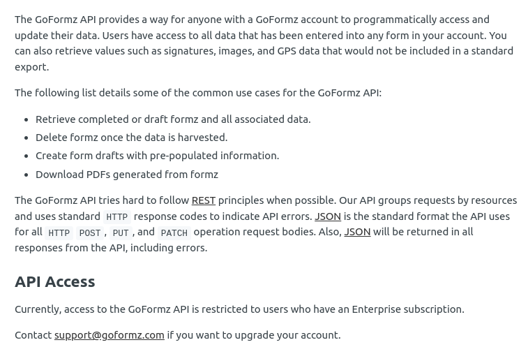

# Propuesta_planet_Solar

## Razonamiento

Una de las razones principales para los retrasos es depender de un mínimo de 3 plataformas simultáneamente abiertas, plataformas que no tienen como compartir información entre ellas. El depender de tantas herramientas, tomando datos de una para ser llevados a la otra es espacio propenso para el error y tiene la consecuencia de trabajo extra al reparar ese error.

Tanta posibilidad de mano humana en ciertos procesos, a veces sin una validación completa de la información (formatos, contenido, etc, etc, etc), hace vulnerable la cadena de producción y genera retrasos que pueden ser solventados a través de un sistema informático que unifique los siguientes elementos:

1. **Jotform**: Al crear una base de datos relacional, cada cliente seria un ID único al cual se le pueden hacer varias cotizaciones de ser necesario.
2. **GoFormz**: Con la información del cliente creada, se puede usar la API de goformz para generar los documentos necesarios y la información necesaria a partir de la que ya existe en el modelo del cliente, reduciendo el procesar la información y rellenando solo los campos que no se poseen. A su vez todos los documentos apuntaran directamente hacia el cliente y el cliente apuntara directamente a todos los documentos.
3.**Lista de Precios, Calculadora de consumo**: Al ser ambos hojas de calculo existentes para procesar la información, se puede generar un espacio dentro de la misma plataforma que haga exactamente lo mismo, con un menor rango de error pues solo mostraría los resultados de las opciones escogidas.
4. **El QUO**: existiendo una base de datos relacional, el quo se vuelve hasta cierto punto innecesario, puesto que al finalizar al cliente, el cotizador puede seleccionar un estatus de los posibles y guardarlo en ese status (propuesta enviada, crédito declinado, crédito aprobado, etc...).
5. **Usuarios**: Este proceso también facilita el seguimiento de los usuarios (trabajadores) que han tenido contacto especifico con la información de un cliente y se puede seguir el proceso debidamente. Ligando el cliente a todos los usuarios que hayan participado en el proceso. Es decir Usuario::Consultor sube la información y es recibida por Usuario::Cotizador1 quien ese día solo llega hasta el crédito aprobado, al día siguiente Usuario::Cotizador2 recibe la información y lleva la propuesta hasta el cierre.
6. **Productos**: Productos en existencia y actuales de planet solar, para realizar ventas, cotizaciones e instalaciones.

## Propuesta de base de datos:

Usando postgreSQL la base de datos estaría centrada en el cliente según el siguiente diagrama:

(Nota, consultar si el codeudor pertence al cliente o a la propiedad antes de agregarlo)

### Breve explicacion:

1. Cliente es elemento central, todos los registros que se generan giran en torno a el, exceptuando productos, lista de precios y equipos.
2. el email del cliente es el unico elemento irrepetible dentro del modelo, puesto que si solo se presentan los ultimos 4 numeros del ssn, existe la posibilidad de repeticion, igual que con nombres. Por esta razon solo debe puede ser editable por una persona con alta autorizacion previa revision de la base de datos.
3. En el modelo propiedad, los elementos unicos son direccion, catastro y coordenadas.
4. Todos los documentos llevan triple ID, el propio, el del cliente y el del cotizador.
5. El modelo equipos hace referencia a la relacion 'lider <---> consultor' para facilitar al cotizador saber a quien pertenece cada consultor. Y tambien, si se llegan a crear nuevos usuarios/trabajadores recursos humanos puede rastrear y asignarlos a un area determinada (para que sean mas faciles de localizar en la base de datos).
6. El cliente lleva tambien el ID del consultor que es 'propietario' de la venta que se le haga a ese cliente.
7. Solo el consultor puede crear propiedades.
8. Solo el cotizador puede crear documentos.
9. Cualquier usuario con la maxima autorizacion puede hacer lo que desee exceptuando tocar los registros de edicion y los snapshots...
10. Snapshots y registros de edicion solo pueden ser eliminados por un usuario llamado Q que es omnipotente, y aun asi no puede alterar el orden de los ID generados en la base de datos, razon por la cual siempre se vera si algo fue indebidamente alterado.

## Usuarios y autorización:

Los usuarios estarían identificados por un atributo llamado rol: de diferentes niveles y para diferentes funciones.

rol:consultor para enviar clientes.
rol:cotizador para procesarlos, editar ciertos parámetros y ver la data completa de los clientes.

También hace falta un nivel de autorización del usuario, para diferenciar a gerentes de trabajadores rasos.

Para agregar a los otros miembros del equipo y las otras funciones debo conocer un poco mejor la empresa y como estamos funcionando.

## Productos:

Aunque no esta contemplado aun en el esquema de la base de datos, existe también la posibilidad de agregar productos/servicios con costos de forma precisa, evitando largas listas. Cuando un producto se agota o no se va usar se coloca en su status ' Descontinuado' y no aparece mas hasta que se modifique o se retome.

## Ventajas

Una base de datos relacional permite:

1. Hacer respaldos livianos de toda la data contenida, en archivos seguros.
2. Estudiar la data existente para reforzar las buenas practicas y corregir los vicios.
3. Revisar de forma organizada los casos y corregir errores de ser necesario.
4. Gestionar revisiones generales de toda la información.
5. Emitir data especifica para su estudio, ejemplo 'Todos los clientes que hayan sido declinados en VIEQUES y no presenten co-deudor'.
6. Agiliza el proceso al centralizar el acceso a las plataformas que se usan en este momento y eliminando los respaldos en googlesheets (puesto que ya existen dentro de la base de datos).
7. Establece una capa de seguridad extra al proteger la data con usuarios y contrasenhas... y a su vez limitando el accesso y las capacidades que tiene el usuario sobre la data.

## GoFormz API

La API (Application Programming Interface) de goformz, en su [documentacion (link para ir)](https://developers.goformz.com/reference/getting-started) permite lo siguiente:

1. Solicitar formz, borradores o completados.
2. Borrar formz una vez la data ha sido recogida.
3. Crear borradores con data prepopulada.
4. Descargar en pdf los formz realizados.

Al ser una API que trabaja principalmente con JSON, un estandar de internet, cualquier lenguaje de programacion puede ser usado, incluyendo ruby y su framework rails.

Actualmente no hay integracion directa con ruby, sin embargo es cuestion de desarrollarla.

El unico impedimento es el acceso a la API, puesto que solo esta disponible para aquellos usuarios que tengan un plan enterprise...

Si no es el caso de Planet Solar, no pasa nada, ya unificar jotform y el quo es un avance lo suficientemente grande al reducir la doble data y el ejercicio de insertarla en un googlesheets al final del turno (lo cual es un proceso propenso a errores).

## Complicaciones:

La existencia de software propio requerira un equipo (al menos dos personas) dedicadas a solventar cualquier inconveniente que pueda surgir del uso inadecuado de la herramienta... Y si se desarrolla entre dos, mejor aun.

Por otro lado, sera requerido hacer respaldos de la base de datos cada cierto tiempo de manera prudencial, asi se evitan complicaciones o perdida de datos masivas, este respaldo debe estar en manos de personas que posean contratos de confidencialidad total con la empresa.

## Costos

Dependiendo del volumen de datos que se generen, pero un servidor alquilado en heroku cuesta alrededor de 25 USD$ mensuales (de acuerdo al volumen de data) + la base de datos postgreSQL que ronda los 5 a los 15$ mensuales para un total aproximado de 40$.

## Interfaz

Para favorecer el traslado de una plataforma a otra, se generaria una interfaz de usuario lo mas similar posible a las herramientas que se usan ahora.